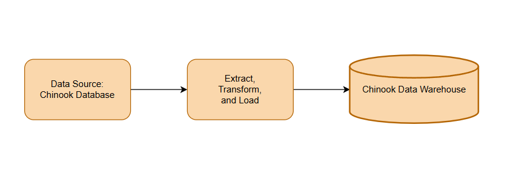
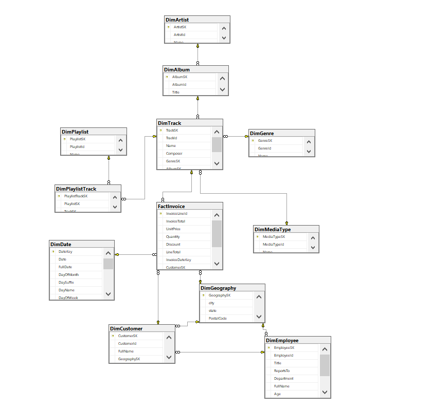
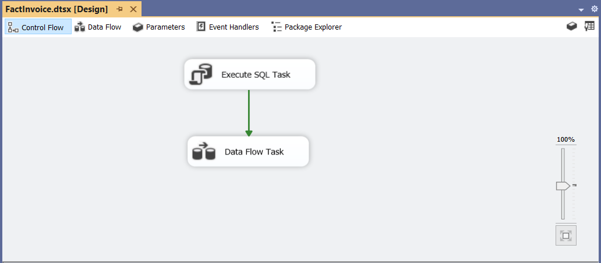
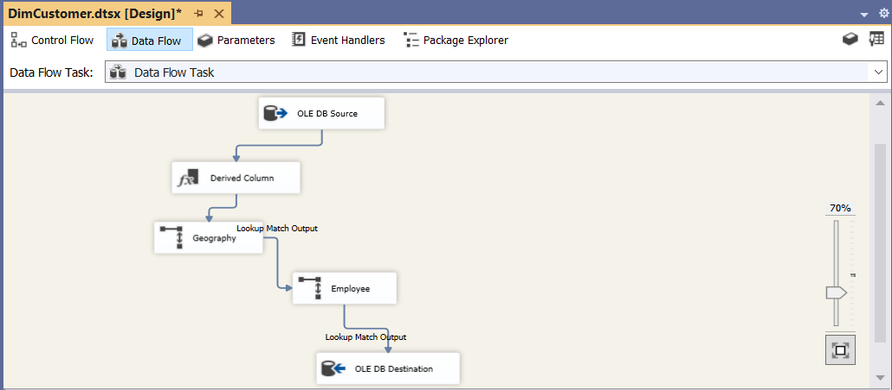
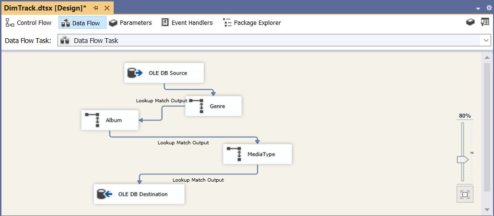
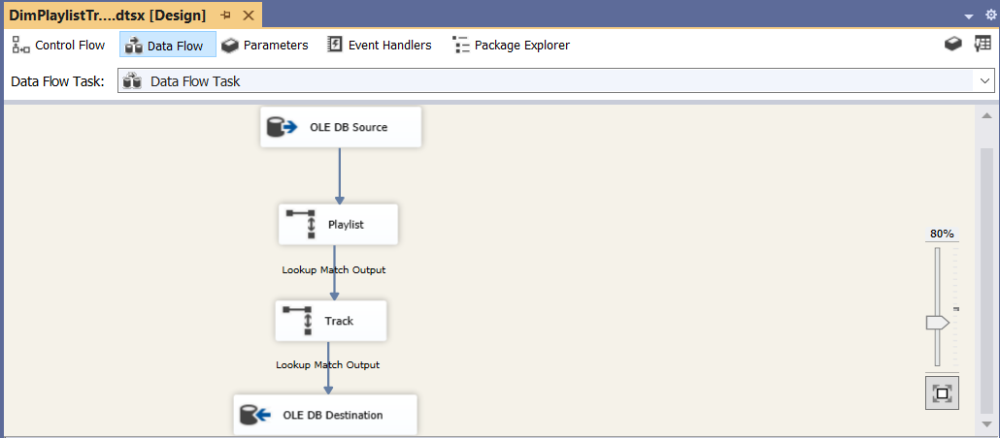

# Chinook-Data-Warehouse
A Snowflake Data Warehouse project for the Chinook database implemented with SQL Server 2022 and SSIS.
# 🎵 Chinook Data Warehouse


## 📌 Project Overview

This project demonstrates the design and implementation of a **Business Intelligence Data Warehouse** based on the **Chinook OLTP database** using **Microsoft SQL Server 2022** and **SQL Server Integration Services (SSIS)**.

The main goal of this project was to transform a normalized transactional database into an analytical data warehouse by designing a **Snowflake Schema**, creating Dimension and Fact tables, and developing a complete ETL pipeline.

The original OLTP structure was redesigned to support analytical queries and reporting by integrating transactional data into a dimensional model.

---

# 🏗 Data Warehouse Architecture

The overall architecture of the Chinook Data Warehouse is shown below:

<p align="center">

</p>

---

# ❄ Snowflake Schema Design

The warehouse follows a **Snowflake Schema** consisting of:

* **11 Dimension Tables**
* **1 Fact Table**

## Dimension Tables

* DimAlbum
* DimArtist
* DimCustomer
* DimDate
* DimEmployee
* DimGenre
* DimGeography
* DimMediaType
* DimPlaylist
* DimPlaylistTrack
* DimTrack

## Fact Table

### FactInvoice

The grain of the Fact table is defined as:

> One record per invoice line transaction.

The FactInvoice table contains the following columns:

* InvoiceLineID
* InvoiceTotal
* UnitPrice
* Quantity
* Discount
* LineTotal
* InvoiceDateKey
* CustomerSK
* TrackSK
* GeographySK

### Measures

* InvoiceTotal
* UnitPrice
* Quantity
* Discount
* LineTotal

<p align="center">

</p>

---

# 🔄 ETL Process

The ETL pipeline was implemented using **SQL Server Integration Services (SSIS)**.

A **Full Load** approach was used in this project. Before loading new data, destination tables are cleared and refreshed from the source OLTP database.

## SSIS Components Used

* OLE DB Source
* OLE DB Destination
* Lookup
* Derived Column
* Sort
* Merge Join

<p align="center">

</p>

---

# 🔑 Surrogate Key Management

All Dimension tables were designed with **Surrogate Keys** to support dimensional modeling principles.

Lookup transformations were used in the FactInvoice ETL process to retrieve the required Surrogate Keys from:

* DimCustomer
* DimTrack
* DimGeography
* DimDate

---

# 🔧 Data Transformations

During the ETL process, additional attributes were created using **Derived Column** transformations.

Examples:

### DimCustomer

Created attributes:

* FullName
* Age
* YearHireDate

Age was calculated dynamically based on the current system date using `GETDATE()`.

<p align="center">

</p>

---

### DimTrack

Track-related information was transformed and loaded into the dimensional model.

<p align="center">

</p>

---

### DimPlaylistTrack

Although this table does not contain direct analytical measures, it was implemented because it resolves the **many-to-many relationship** between playlists and tracks.

Keeping this bridge dimension prevents incorrect relationships between:

* DimPlaylist
* DimTrack

<p align="center">

</p>

---

# 💡 Key Design Decisions

Several important modeling decisions were made during the development of this warehouse:

### 1. Combining Invoice and InvoiceLine

Instead of creating separate FactInvoice and FactInvoiceLine tables, both transactional tables were integrated into a single **FactInvoice** table to provide a unified analytical model.

### 2. Snowflake Schema Implementation

A Snowflake Schema was selected to represent hierarchical relationships and reduce redundant data.

### 3. Handling Many-to-Many Relationships

The DimPlaylistTrack table was preserved as a bridge dimension to correctly model the many-to-many relationship between playlists and tracks.

### 4. Surrogate Keys

Surrogate keys were implemented for all Dimension tables to improve warehouse design and maintain dimensional modeling standards.

---

# 🛠 Technologies Used

* Microsoft SQL Server 2022
* SQL Server Integration Services (SSIS)
* SQL
* ETL
* Data Warehouse
* Snowflake Schema
* Dimensional Modeling

---

# 📂 Repository Structure

```text
Chinook-Data-Warehouse
│
├── Images
│   ├── ChinookDWArchitecture.png
│   ├── SnowflakeSchema.png
│   ├── SSIS_ControlFlow.png
│   ├── FactInvoiceDataFlow.png
│   ├── DimCustomerDataFlow.png
│   ├── DimTrackDataFlow.png
│   └── DimPlaylistTrackDataFlow.png
│
├── SSIS
│   ├── ChinookDW.sln
│   ├── ChinookDW.dtproj
│   ├── *.dtsx
│
│
├── SQL Scripts
│
└── README.md
```

---

# 🚀 Future Improvements

Future improvements that can extend this project:

* Developing SSAS Multidimensional or Tabular models
* Creating analytical reports using SSRS
* Building interactive dashboards using Power BI
* Implementing Incremental Load instead of Full Load
* Adding Slowly Changing Dimensions (SCD)

---

# 📷 Project Images

All project diagrams and SSIS workflow screenshots are available in the **Images** directory.
